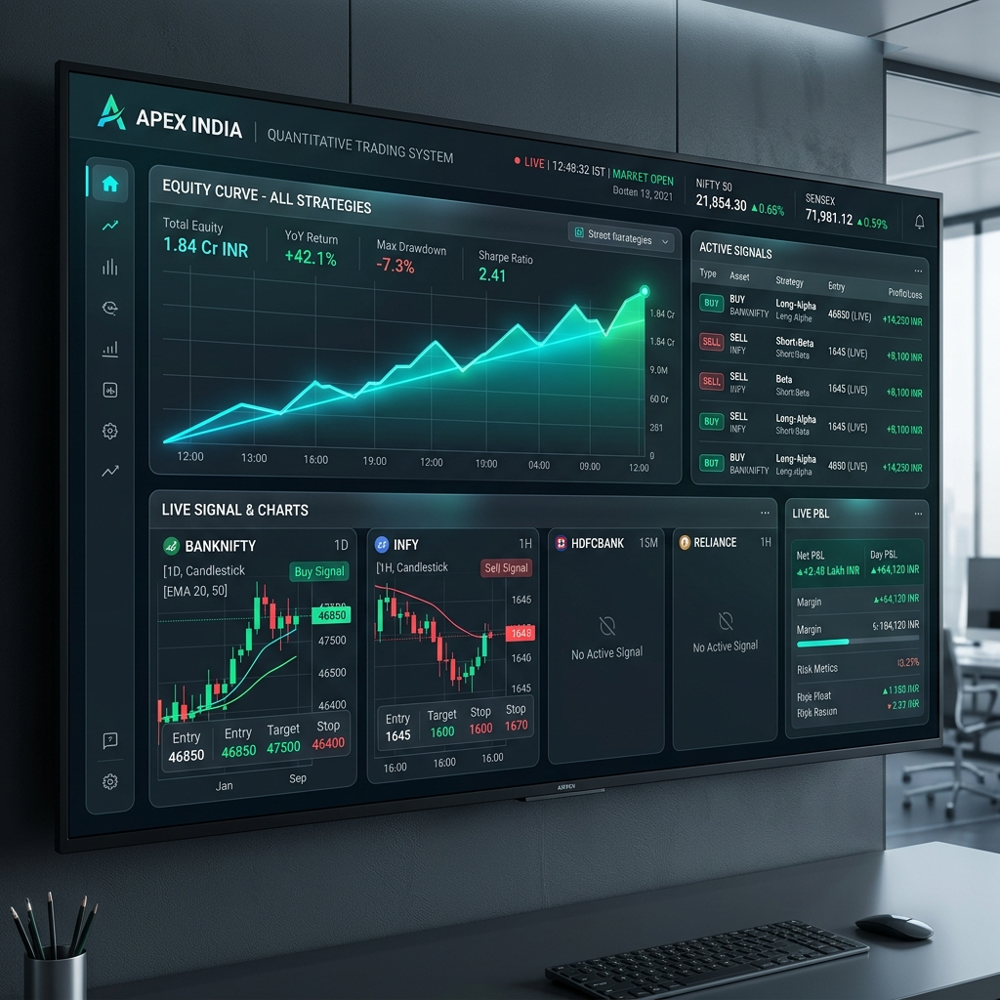

<div align="center">

# APEX INDIA
### Autonomous Quantitative Trading Intelligence
**Zero-Cost Market Data &middot; Advanced ML Sentiment &middot; Precision Execution**

[](https://github.com/Vshn2k5/TRADE)
[](https://github.com/Vshn2k5/TRADE)
[](https://github.com/Vshn2k5/TRADE)
[](https://github.com/Vshn2k5/TRADE)

*"The market rewards patience, punishes greed, and destroys those without a plan."*

---



</div>

## 🌌 System Identity
**APEX INDIA** is an elite, fully autonomous quantitative trading engine purpose-built for the **Indian Financial Markets** (NSE/BSE/MCX). Designed for high-reliability execution with zero recurring data costs, it bridges the gap between retail trading and institutional-grade algorithmic intelligence.

### 🎯 Core Objectives
- **Alpha Generation**: 10 distinct strategies optimized for different market regimes.
- **Risk Preservation**: 4-layer stop-loss architecture and hard capital constraints.
- **Zero-Cost Edge**: Uses `yfinance` and NSE-direct scapers for premium data without the premium price.
- **Glassmorphic UX**: A stunning Command Center dashboard for real-time monitoring and remote control.

---

## ⚡ Key Features

| Category | Highlights |
| :--- | :--- |
| **🧠 Intelligence** | 10+ Strategies, Market Regime Detection, Sentiment Analysis (FinBERT), ML Price Classifiers. |
| **🛡️ Risk** | 1% Max Risk/Trade, Daily/Weekly Circuit Breakers, 15% Drawdown Hard Halt, ATR-based Stop Sizing. |
| **🚀 Execution** | Zerodha Kite / Upstox Integration, Paper Trading Simulation, WebSocket Low-Latency Feeds. |
| **🖥️ Dashboard** | FastAPI + Glassmorphism Web Interface, Real-time P&L, Signal Lab, System Status Central. |

---

## 🏗️ Technical Architecture
APEX INDIA operates on a decoupled **7-Layer Infrastructure**:

1.  **Data Layer**: Multi-source ingestion (WebSockets, yfinance, NSE Scraping).
2.  **Intelligence Layer**: Feature engineering for 130+ technical indicators.
3.  **Regime Engine**: HMM-based classification of market states (Trending, Reverting, Volatile).
4.  **Strategy Lab**: Parallel execution of 10 proprietary trading models.
5.  **Decision Gate**: Composite scoring logic (Confidence 0-100) before any trade execution.
6.  **Risk Shield**: Real-time position sizing and stop-loss management.
7.  **Command Center**: Premium frontend for system oversight and manual override.

---

## 🧪 Strategy Lab: The 10 Proprietary Models
The system automatically toggles between these strategies based on the identified **Market Regime**.

| # | Strategy | Primary Regime | Logic |
| :-- | :-- | :-- | :-- |
| 01 | **Trend Rider** | Trending | EMA Ribbon Alignment (21/50/200) + ADX Trend Strength. |
| 02 | **Vol Breakout** | Breakout | BB Squeeze detection + sudden Volume/Volatility expansion. |
| 03 | **VWAP Reversion** | Reverting | Mean reversion from VWAP ±2.5σ with RSI exhaustion. |
| 04 | **ORB (15m)** | Opening | First 15-min range high/low breakout with volume confirmation. |
| 05 | **Earnings Drift** | Post-Event | EPS Surprise (>15%) followed by multi-day drift patterns. |
| 06 | **Sector Rotation** | Trending | Capital allocation into top 3 sectors with relative strength. |
| 07 | **Theta Harvest** | Low Vol | Delta-neutral Iron Condors/Strangles for time decay. |
| 08 | **SMC Reversal** | Distribution | Smart Money footprints: BOS, CHoCH, and Order Blocks. |
| 09 | **Gap Trade** | Trending | Gap-and-go patterns validated against pre-market global cues. |
| 10 | **Swing Positional** | Any | Institutional accumulation patterns (Cup & Handle, Bull Flags). |

---

## 🕹️ Command Center (Dashboard)
The **APEX INDIA Dashboard** is a high-performance web interface designed with **Glassmorphism** aesthetics.
- **Live Status**: Real-time IST clock, Market status (Open/Closed), and System Mode (Paper/Real).
- **Metric Grid**: Instant feedback on Equity, Day P&L, Active Trades, and Win Rate.
- **Equity Curve**: Dynamic Chart.js visualization of your account growth.
- **Signal Feed**: Direct stream of incoming alpha alerts before execution.
- **Safety Switch**: One-click **HALT TRADING** for emergency manual intervention.

---

## 🛠️ Installation & Setup

### Prerequisites
- **Python 3.11+**
- **Zerodha Kite Connect** or **Upstox API** credentials.
- Recommended RAM: **8GB+** for ML model inference.

### Quick Start
```bash
# 1. Clone the repository
git clone https://github.com/Vshn2k5/TRADE.git
cd TRADE

# 2. Setup environment
python -m venv venv
source venv/bin/activate  # Windows: .\venv\Scripts\activate

# 3. Install dependencies
pip install -r requirements.txt

# 4. Configure
cp .env.example .env
# [!] Edit .env with your API keys and configuration

# 5. Initialize & Check
python main.py --init-db
python main.py --status
```

---

## ⚖️ Governance & Risk
APEX INDIA is governed by **Iron-Clad Constraints** to ensure capital survival:
- **Max Drawdown**: 15% (System completely halts until manual audit).
- **Daily Loss Limit**: 2.5% (Trading ceases for the remainder of the day).
- **Position Limit**: Max 10 concurrent intraday exposures.
- **Sector Limit**: No more than 25% exposure in any single sector.

---

<div align="center">

**Built on discipline. Powered by intelligence. Governed by risk.**

*v3.1.0 | April 2026 | [APEX INDIA GitHub](https://github.com/Vshn2k5/TRADE)*

</div>

---

> **Disclaimer**: This software is for educational and research purposes. Trading in financial markets involves substantial risk. The developers are not responsible for any financial losses. Always trade with capital you can afford to lose.
