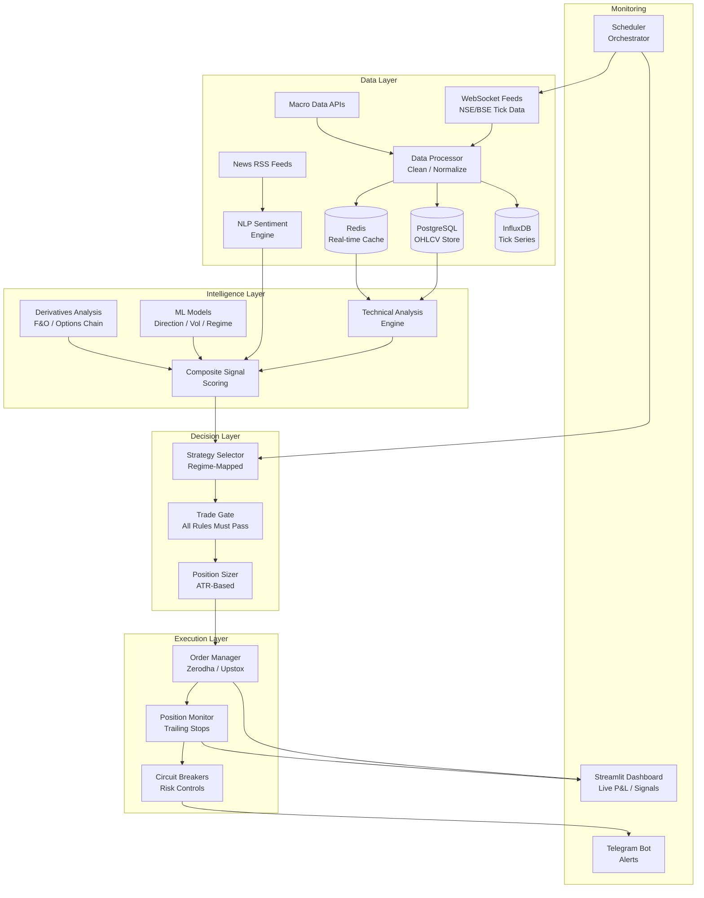
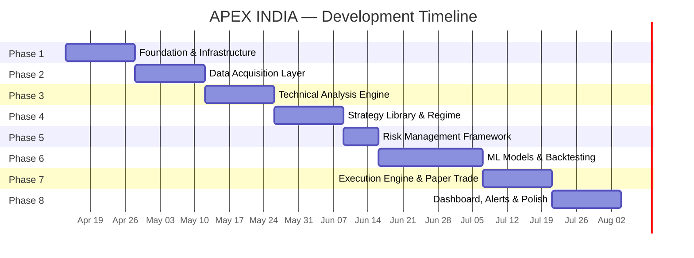

# APEX INDIA — Implementation Plan
## Autonomous Quantitative Trading System for Indian Markets

---

## Project Analysis Summary

The APEX INDIA system is a **production-grade, autonomous quantitative trading platform** designed for Indian financial markets (BSE Sensex, Nifty 50, F&O, MCX). It is composed of **11 interconnected subsystems** spanning data ingestion, technical/fundamental analysis, ML-driven signal generation, multi-strategy execution, risk management, and a real-time monitoring dashboard.

### Scale & Complexity Assessment

| Dimension | Assessment |
|---|---|
| **Codebase Size** | ~15,000–25,000 lines of Python + config + dashboard |
| **Subsystems** | 11 major modules (data, strategies, ML, execution, risk, dashboard, alerts, backtesting, scheduler, config, main) |
| **External APIs** | 4–6 (Zerodha Kite, Upstox, NSE data feeds, news APIs, Telegram, Twilio) |
| **ML Models** | 5 (LightGBM/XGBoost ensemble, GARCH+LSTM, HMM+RF, DQN, FinBERT) |
| **Strategies** | 10 distinct trading strategies |
| **Databases** | PostgreSQL (OHLCV), Redis (real-time cache), InfluxDB (time-series) |
| **Total Effort** | ~8–12 weeks for an MVP; 16–24 weeks for production-grade |

---

## User Review Required

> [!IMPORTANT]
> **Broker API Selection**: The prompt mentions both Zerodha Kite and Upstox. For Phase 1, should we target **one primary broker** (Zerodha Kite recommended — most popular, well-documented SDK) and add Upstox later? Or implement both from the start?

> [!IMPORTANT]
> **Data Source API Keys**: You will need active API subscriptions for:
> - Zerodha Kite Connect (₹2,000/month) or Upstox API
> - A news data API (or RSS scraping)
> - Telegram Bot API token
> - (Optional) Twilio for SMS alerts
>
> Do you already have these, or should the system be built with mock data first?

> [!WARNING]
> **Deployment Environment**: The prompt specifies a Mumbai-based VPS with Docker. For development, we'll build everything to run locally on your Windows machine. Production deployment (Linux VPS + Docker) will be a separate deployment phase. Is this acceptable?

> [!CAUTION]
> **Live Trading Risk**: This system will manage real capital. The plan includes a **Paper Trading phase** (Phase 7b) before any live execution. Auto-execution must be gated behind explicit user confirmation.

---

## Architecture Overview



---

## Phase-Wise Implementation Plan

---

### 🏗️ PHASE 1: Project Foundation & Infrastructure (Week 1–2)

**Goal**: Set up the project skeleton, configuration system, database schemas, and development environment.

---

#### [NEW] [main.py](file:///c:/Users/Admin/Desktop/TRADE/main.py)
- System entry point with CLI argument parsing
- Start/stop/status commands
- Loads configuration and bootstraps all subsystems
- Graceful shutdown handler (Ctrl+C, SIGTERM)

#### [NEW] [config.yaml](file:///c:/Users/Admin/Desktop/TRADE/config.yaml)
- All system parameters in a single YAML file
- Sections: `broker`, `risk`, `strategies`, `models`, `dashboard`, `alerts`, `database`
- Environment variable overrides for secrets (API keys)

#### [NEW] [requirements.txt](file:///c:/Users/Admin/Desktop/TRADE/requirements.txt)
- All Python dependencies pinned to specific versions
- Core: `pandas`, `numpy`, `scipy`, `pyyaml`
- Indicators: `pandas-ta`, `ta-lib` (optional)
- ML: `scikit-learn`, `lightgbm`, `xgboost`, `torch`, `transformers`, `stable-baselines3`, `statsmodels`, `optuna`
- Broker: `kiteconnect`, `upstox-python-sdk`
- Data: `redis`, `psycopg2`, `influxdb-client`, `sqlalchemy`
- Dashboard: `streamlit`, `plotly`
- Alerts: `python-telegram-bot`, `twilio`
- Async: `asyncio`, `aiohttp`, `websockets`

#### [NEW] [scheduler.py](file:///c:/Users/Admin/Desktop/TRADE/scheduler.py)
- Main event loop / orchestrator
- Schedules tasks: data ingestion, signal computation, model updates, report generation
- Uses `APScheduler` for cron-like scheduling
- Market-hours awareness (09:15–15:30 IST)

#### [NEW] [apex_india/__init__.py](file:///c:/Users/Admin/Desktop/TRADE/apex_india/__init__.py)
- Package initialization

#### Database Schema Setup

| Database | Purpose | Key Tables/Collections |
|---|---|---|
| **PostgreSQL** | OHLCV history, trade log, strategy performance | `ohlcv_data`, `trade_signals`, `executed_trades`, `strategy_performance`, `watchlist` |
| **Redis** | Real-time tick cache, position state, signal queue | Keys: `tick:{symbol}`, `position:{id}`, `signal:queue`, `regime:current` |
| **InfluxDB** | High-frequency tick data, system metrics | Measurements: `ticks`, `indicators`, `pnl_realtime`, `system_health` |

#### [NEW] [apex_india/data/storage/models.py](file:///c:/Users/Admin/Desktop/TRADE/apex_india/data/storage/models.py)
- SQLAlchemy ORM models for PostgreSQL tables
- `OHLCVData`, `TradeSignal`, `ExecutedTrade`, `StrategyPerformance`, `Watchlist`

#### [NEW] [apex_india/data/storage/database.py](file:///c:/Users/Admin/Desktop/TRADE/apex_india/data/storage/database.py)
- Database connection manager (connection pooling)
- Redis client singleton
- InfluxDB write/query client
- Migration/initialization scripts

#### [NEW] [apex_india/utils/logger.py](file:///c:/Users/Admin/Desktop/TRADE/apex_india/utils/logger.py)
- Structured logging with `loguru` or Python logging
- Separate log files: `trading.log`, `errors.log`, `system.log`
- JSON-formatted for production; pretty for development
- Log rotation and retention policies

#### [NEW] [apex_india/utils/constants.py](file:///c:/Users/Admin/Desktop/TRADE/apex_india/utils/constants.py)
- Market hours, exchange codes, instrument types
- NSE sector index symbols
- Nifty 50 / Nifty 200 constituent lists
- Lot sizes for F&O instruments

**Phase 1 Deliverable**: A running project skeleton where `python main.py --status` returns system configuration and database connectivity status.

---

### 📡 PHASE 2: Data Acquisition Layer (Week 2–4)

**Goal**: Build the complete data ingestion pipeline — live market feeds, historical data, macro data, and news/sentiment.

---

#### [NEW] [apex_india/data/feeds/websocket_handler.py](file:///c:/Users/Admin/Desktop/TRADE/apex_india/data/feeds/websocket_handler.py)
- Zerodha Kite WebSocket client for real-time tick data
- Auto-reconnect with exponential backoff
- Tick data normalization and validation
- Publish to Redis for downstream consumers
- Handle: LTP, OHLC, Volume, OI, Bid/Ask depth (Level-2)

#### [NEW] [apex_india/data/feeds/historical_data.py](file:///c:/Users/Admin/Desktop/TRADE/apex_india/data/feeds/historical_data.py)
- Fetch historical OHLCV data from Kite API
- Support all timeframes: 1min → 1W
- Backfill missing data on startup
- Store in PostgreSQL with deduplication
- Rate limiting to respect API quotas

#### [NEW] [apex_india/data/feeds/nse_data.py](file:///c:/Users/Admin/Desktop/TRADE/apex_india/data/feeds/nse_data.py)
- NSE India website scraper for:
  - FII/DII daily activity data
  - Option chain data (all strikes, all expiries)
  - Delivery percentage data
  - Block/Bulk deal data
  - F&O ban list
- Cached with TTL (5-minute refreshes during market hours)

#### [NEW] [apex_india/data/feeds/macro_data.py](file:///c:/Users/Admin/Desktop/TRADE/apex_india/data/feeds/macro_data.py)
- RBI data feeds (repo rate, CPI, GDP)
- Global macro: DXY, US 10Y yield, Crude, Gold via free APIs (Yahoo Finance / Alpha Vantage)
- Economic calendar with event scheduling
- IMD monsoon data (seasonal)

#### [NEW] [apex_india/data/feeds/news_feed.py](file:///c:/Users/Admin/Desktop/TRADE/apex_india/data/feeds/news_feed.py)
- RSS feed aggregator: Economic Times, Moneycontrol, Business Standard, BloombergQuint
- Rate-limited polling (every 1–2 minutes)
- Deduplication by headline hash
- Dispatch to NLP sentiment pipeline

#### [NEW] [apex_india/data/processors/data_cleaner.py](file:///c:/Users/Admin/Desktop/TRADE/apex_india/data/processors/data_cleaner.py)
- Handle missing data (forward-fill OHLCV gaps)
- Detect and flag anomalous ticks (outlier detection)
- Timezone normalization (IST)
- Corporate action adjustment (splits, bonuses, dividends)

#### [NEW] [apex_india/data/processors/feature_engineer.py](file:///c:/Users/Admin/Desktop/TRADE/apex_india/data/processors/feature_engineer.py)
- Compute derived data streams:
  - Tick volume profile
  - Market microstructure metrics (bid-ask spread, order flow imbalance)
  - Rolling VWAP with bands
  - Cumulative delta
  - Market breadth indicators (advance/decline, % above DMA)
- Feature matrix construction for ML models

**Phase 2 Deliverable**: Live tick data streaming into Redis, historical OHLCV in PostgreSQL, option chain data refreshing every 5 mins, and news feed ingesting articles in real-time.

---

### 📊 PHASE 3: Technical Analysis & Signal Engine (Week 4–6)

**Goal**: Implement the full technical indicator stack, derivatives analysis, sector analysis, and the composite scoring system.

---

#### [NEW] [apex_india/data/indicators/trend.py](file:///c:/Users/Admin/Desktop/TRADE/apex_india/data/indicators/trend.py)
- EMA (21, 50, 200), ADX (14), Ichimoku Cloud, Heikin-Ashi, Supertrend
- All indicators computed per-symbol, per-timeframe
- Cached in Redis for real-time access

#### [NEW] [apex_india/data/indicators/momentum.py](file:///c:/Users/Admin/Desktop/TRADE/apex_india/data/indicators/momentum.py)
- RSI (14), Connors RSI, MACD, Stochastic RSI, ROC, Williams %R
- RSI divergence detection algorithm
- MACD histogram divergence detection

#### [NEW] [apex_india/data/indicators/volatility.py](file:///c:/Users/Admin/Desktop/TRADE/apex_india/data/indicators/volatility.py)
- Bollinger Bands (20,2), BB Squeeze detection, %B
- ATR (14), Keltner Channels
- Historical vs. Implied Volatility comparison
- India VIX integration

#### [NEW] [apex_india/data/indicators/volume.py](file:///c:/Users/Admin/Desktop/TRADE/apex_india/data/indicators/volume.py)
- VWAP + bands, OBV, A/D Line, Chaikin Money Flow
- Volume Profile (POC, VAH, VAL)
- Unusual volume spike detection
- Delivery vs. intraday volume ratio

#### [NEW] [apex_india/data/indicators/price_action.py](file:///c:/Users/Admin/Desktop/TRADE/apex_india/data/indicators/price_action.py)
- Swing high/low pivot detection
- Support/Resistance level computation
- Fibonacci retracement/extension
- Candlestick pattern recognition (engulfing, pin bar, doji, etc.)
- Chart pattern detection (H&S, cup & handle, flags, triangles)
- Smart Money Concepts: BOS, CHoCH, Order Blocks, FVG, Liquidity sweeps

#### [NEW] [apex_india/data/indicators/derivatives.py](file:///c:/Users/Admin/Desktop/TRADE/apex_india/data/indicators/derivatives.py)
- Option chain analysis: PCR, max pain, OI buildup classification
- IV Rank / IV Percentile computation
- Gamma Exposure (GEX) calculation
- Unusual options activity detection
- Skew analysis
- Futures basis, rollover analysis, FII positioning

#### [NEW] [apex_india/data/indicators/sector.py](file:///c:/Users/Admin/Desktop/TRADE/apex_india/data/indicators/sector.py)
- Nifty sector index tracking
- Sector rotation model
- Relative Strength vs. Nifty 50
- Sector momentum ranking (1M, 3M, 6M, 12M)
- Inter-market correlation analysis
- Stock rank within sector

#### [NEW] [apex_india/data/indicators/composite_scorer.py](file:///c:/Users/Admin/Desktop/TRADE/apex_india/data/indicators/composite_scorer.py)
- **Unified Composite Signal Scoring System** (the core brain)
- Computes: `TECHNICAL_SCORE`, `FUNDAMENTAL_SCORE`, `SENTIMENT_SCORE`, `DERIVATIVES_SCORE`
- Computes: `FINAL_CONFIDENCE` (weighted composite)
- Trade Gate Rules enforcement (all must pass)
- Signal grading: A+ / A / B+ / B

**Phase 3 Deliverable**: Given any symbol + timeframe, the system produces a complete technical analysis with a composite confidence score. All indicators are unit-tested against known values.

---

### 🧠 PHASE 4: Strategy Library & Regime Detection (Week 6–8)

**Goal**: Implement all 10 trading strategies with regime-based automatic selection.

---

#### [NEW] [apex_india/strategies/base_strategy.py](file:///c:/Users/Admin/Desktop/TRADE/apex_india/strategies/base_strategy.py)
- Abstract base class for all strategies
- Interface: `generate_signals()`, `validate_entry()`, `compute_targets()`, `should_exit()`
- Common methods: timeframe alignment, volume confirmation, timing filters
- Strategy metadata: name, version, applicable regimes, backtest performance

#### [NEW] [apex_india/models/regime/regime_detector.py](file:///c:/Users/Admin/Desktop/TRADE/apex_india/models/regime/regime_detector.py)
- Market regime classification engine
- 7 regimes: TRENDING_BULLISH, TRENDING_BEARISH, MEAN_REVERTING, HIGH_VOLATILITY, BREAKOUT_PENDING, DISTRIBUTION, ACCUMULATION
- Uses: ADX, EMA positioning, breadth, VIX, BB Width, OI, OBV, CMF
- Updates every 15 minutes during market hours

#### Strategy Implementations (10 strategies):

| # | Strategy | File | Regime |
|---|---|---|---|
| 1 | Trend Momentum Rider | `momentum/trend_rider.py` | TRENDING |
| 2 | Volatility Breakout | `breakout/vol_breakout.py` | BREAKOUT_PENDING |
| 3 | VWAP Mean Reversion | `mean_reversion/vwap_mr.py` | MEAN_REVERTING |
| 4 | Opening Range Breakout | `breakout/orb.py` | All (except high uncertainty) |
| 5 | Earnings Momentum | `momentum/earnings.py` | Post-earnings |
| 6 | Sector Rotation | `momentum/sector_rotation.py` | TRENDING (weekly) |
| 7 | Options Theta Harvest | `options/theta_harvest.py` | LOW_VOL / Sideways |
| 8 | SMC Reversal | `smc/smc_reversal.py` | DISTRIBUTION / ACCUMULATION |
| 9 | Gap Trade | `momentum/gap_trade.py` | TRENDING |
| 10 | Swing Positional | `momentum/swing_positional.py` | Any (ADX > 20) |

#### [NEW] [apex_india/strategies/strategy_selector.py](file:///c:/Users/Admin/Desktop/TRADE/apex_india/strategies/strategy_selector.py)
- Autonomous strategy selection logic
- Called every 60 seconds during market hours
- Pipeline: Regime → Universe Screening → Scoring → Ranking → Timing → Risk Gate → Top 3

#### [NEW] [apex_india/strategies/timing.py](file:///c:/Users/Admin/Desktop/TRADE/apex_india/strategies/timing.py)
- Time-of-day intelligence (pre-open → post-close)
- Calendar intelligence (expiry week, RBI policy, budget, elections)
- Entry precision timing (scale-in thirds, confirmation candle wait)
- Optimal entry window enforcement

**Phase 4 Deliverable**: The system can detect the current market regime, select appropriate strategies, screen the universe, and produce ranked trade candidates with timing recommendations. All strategies are backtestable.

---

### 🛡️ PHASE 5: Risk Management Framework (Week 8–9)

**Goal**: Implement the complete risk management system — position sizing, stop-loss architecture, portfolio controls, and circuit breakers.

---

#### [NEW] [apex_india/risk/position_sizer.py](file:///c:/Users/Admin/Desktop/TRADE/apex_india/risk/position_sizer.py)
- ATR-based volatility-adjusted position sizing
- Hard 1% risk per trade rule
- Max single stock exposure (8%), sector (25%), correlated (40%)
- Kelly Criterion (half-Kelly) integration
- Lot size rounding for F&O

#### [NEW] [apex_india/risk/stop_loss_manager.py](file:///c:/Users/Admin/Desktop/TRADE/apex_india/risk/stop_loss_manager.py)
- **Layer 1**: Initial hard stop (structure-based or ATR-based)
- **Layer 2**: Trailing stop (ATR-based, Parabolic SAR secondary)
- **Layer 3**: Time-based stops (intraday close by 15:15, swing 5-day rule)
- **Layer 4**: Break-even stop activation at 1:1 RR
- Never move stop further from entry — enforced programmatically

#### [NEW] [apex_india/risk/circuit_breaker.py](file:///c:/Users/Admin/Desktop/TRADE/apex_india/risk/circuit_breaker.py)
- Daily loss limit: 2.5% → halt trading
- Weekly loss limit: 5.0% → reduce size 50%
- Monthly loss limit: 8.0% → strategy recalibration
- Max drawdown: 15% from peak → complete halt + audit
- VIX emergency: VIX > 35 → exit all, 80%+ cash

#### [NEW] [apex_india/risk/portfolio_risk.py](file:///c:/Users/Admin/Desktop/TRADE/apex_india/risk/portfolio_risk.py)
- Correlation monitoring (reduce when 3+ positions have r > 0.7)
- Portfolio beta management (0.8–1.4 vs Nifty)
- Hedging rules (Nifty puts when > 80% deployed)
- Diversification enforcement (min 4 sectors)
- Liquidity risk (max 3% of ADV)
- Cash buffer management (min 15%)

**Phase 5 Deliverable**: Complete risk layer that can be unit-tested with simulated portfolios. No trade can bypass risk checks.

---

### 🤖 PHASE 6: Machine Learning & Adaptive Intelligence (Week 9–12)

**Goal**: Build, train, and validate the 5 ML models. Implement backtesting engine and continuous learning loop.

---

#### ML Models

#### [NEW] [apex_india/models/direction/price_classifier.py](file:///c:/Users/Admin/Desktop/TRADE/apex_india/models/direction/price_classifier.py)
- LightGBM + XGBoost ensemble
- 150+ features (technical, fundamental, sentiment, derivatives)
- Target: 5-day return direction (up/down/neutral)
- Walk-forward validation with 3-month OOS
- Weekly retraining with rolling 2-year window

#### [NEW] [apex_india/models/volatility/vol_predictor.py](file:///c:/Users/Admin/Desktop/TRADE/apex_india/models/volatility/vol_predictor.py)
- GARCH(1,1) + LSTM hybrid
- Predicts ATR 5 days forward
- Outputs: volatility distribution (mean + confidence interval)
- Used by position sizer for forward-looking risk

#### [NEW] [apex_india/models/regime/hmm_regime.py](file:///c:/Users/Admin/Desktop/TRADE/apex_india/models/regime/hmm_regime.py)
- Hidden Markov Model + Random Forest
- 4 hidden states: Trending Bull, Trending Bear, Mean-Reverting, High-Vol
- Daily update frequency
- Regime transition probability matrix

#### [NEW] [apex_india/models/timing/dqn_entry.py](file:///c:/Users/Admin/Desktop/TRADE/apex_india/models/timing/dqn_entry.py)
- Deep Q-Network (Reinforcement Learning)
- State: market microstructure + technical signals
- Actions: Enter now / Wait 5min / Wait 15min / Skip
- Reward: risk-adjusted return after 1hr / 1day
- Training: simulated environment with 3 years of tick data

#### [NEW] [apex_india/models/sentiment/finbert_india.py](file:///c:/Users/Admin/Desktop/TRADE/apex_india/models/sentiment/finbert_india.py)
- FinBERT fine-tuned on Indian financial news
- Input: news headline + body
- Output: direction probability + magnitude + duration
- NER for company/sector/regulatory entity extraction

#### Backtesting Engine

#### [NEW] [apex_india/backtesting/engine.py](file:///c:/Users/Admin/Desktop/TRADE/apex_india/backtesting/engine.py)
- Core backtesting loop with realistic assumptions
- Brokerage: 0.03% per leg, STT, SEBI charges, stamp duty, GST
- Slippage: 0.05–0.15%, market impact: 0.02–0.1%
- Latency simulation: 50–200ms

#### [NEW] [apex_india/backtesting/walk_forward.py](file:///c:/Users/Admin/Desktop/TRADE/apex_india/backtesting/walk_forward.py)
- Walk-forward optimization (expanding window)
- Anti-overfitting: train/test within 20%

#### [NEW] [apex_india/backtesting/monte_carlo.py](file:///c:/Users/Admin/Desktop/TRADE/apex_india/backtesting/monte_carlo.py)
- 10,000-run Monte Carlo simulation
- Confidence intervals for key metrics

#### [NEW] [apex_india/backtesting/metrics.py](file:///c:/Users/Admin/Desktop/TRADE/apex_india/backtesting/metrics.py)
- Sharpe, Sortino, Calmar, Recovery Factor, Profit Factor
- Max Drawdown, Win Rate, Average Win/Loss, CAGR
- Performance thresholds enforcement

#### Continuous Learning

#### [NEW] [apex_india/models/adaptive_engine.py](file:///c:/Users/Admin/Desktop/TRADE/apex_india/models/adaptive_engine.py)
- `daily_model_update()`: evaluate today's predictions, retrain if accuracy drops for 5 days
- `weekly_strategy_review()`: live vs. backtest Sharpe comparison, signal weight adjustment
- `regime_change_detection()`: HMM probability update every 15 minutes
- `performance_attribution()`: monthly factor decomposition

**Phase 6 Deliverable**: All 5 ML models trained and validated on historical data. Backtesting engine producing performance reports. Each strategy passes backtest thresholds (Sharpe > 1.5, CAGR > 20%, Max DD < 15%).

---

### ⚡ PHASE 7: Execution Engine & Broker Integration (Week 12–14)

**Goal**: Build the order management system, broker API integration, position monitoring, and smart execution.

---

#### [NEW] [apex_india/execution/broker_zerodha.py](file:///c:/Users/Admin/Desktop/TRADE/apex_india/execution/broker_zerodha.py)
- Kite Connect API wrapper
- Authentication flow (login token, access token refresh)
- Order placement: MARKET, LIMIT, SL, SL-M
- Product types: CNC (delivery), MIS (intraday), NRML (F&O)
- Bracket orders with SL + target
- Order status polling, modification, cancellation
- Retry logic with exponential backoff (3 attempts)

#### [NEW] [apex_india/execution/broker_upstox.py](file:///c:/Users/Admin/Desktop/TRADE/apex_india/execution/broker_upstox.py)
- Upstox API wrapper (secondary broker)
- Same interface as Zerodha wrapper (broker-agnostic design)

#### [NEW] [apex_india/execution/order_manager.py](file:///c:/Users/Admin/Desktop/TRADE/apex_india/execution/order_manager.py)
- Order lifecycle: Signal → Pre-check → Place → Confirm → Monitor → Exit
- Pre-execution safety assertions (confidence, RR, capital, risk gate, market open)
- TWAP/VWAP smart execution for orders > ₹5 lakh
- Order tagging: `APEX_{strategy_id}_{signal_id}`
- Disclosed quantity for large positions

#### [NEW] [apex_india/execution/position_monitor.py](file:///c:/Users/Admin/Desktop/TRADE/apex_india/execution/position_monitor.py)
- Runs every 60 seconds
- Trailing stop updates (2 ATR from highest high)
- Partial profit booking at 1:1 RR (33%)
- Break-even stop activation
- Early exit detection (stop hit, counter signal, market circuit, correlation risk, time stop)

#### [NEW] [apex_india/execution/paper_trader.py](file:///c:/Users/Admin/Desktop/TRADE/apex_india/execution/paper_trader.py)
- **Paper trading mode** — simulates execution without real orders
- Uses live market data for realistic fills
- Tracks simulated P&L, positions, and performance
- Critical validation step before going live

#### Trade Signal Output

#### [NEW] [apex_india/execution/signal_formatter.py](file:///c:/Users/Admin/Desktop/TRADE/apex_india/execution/signal_formatter.py)
- Formats trade signals in the specified ASCII box format
- All required fields: Signal ID, instrument, strategy, regime, entry/SL/targets, position size, confidence, technical/fundamental/sentiment/F&O details, reasoning summary
- JSON serialization for API consumption
- Human-readable output for Telegram/dashboard

**Phase 7 Deliverable**: Paper trading system running with live data, executing simulated trades, tracking P&L, and producing formatted trade signals. At least 2 weeks of paper trading before any live mode consideration.

---

### 📊 PHASE 8: Dashboard, Alerts & Production Polish (Week 14–16)

**Goal**: Build the Streamlit monitoring dashboard, Telegram bot, alerting system, and production hardening.

---

#### [NEW] [apex_india/dashboard/app.py](file:///c:/Users/Admin/Desktop/TRADE/apex_india/dashboard/app.py)
- Streamlit main application
- Pages: Live Trading, Portfolio, Signals, Backtesting, Settings
- Auto-refresh every 30 seconds during market hours

#### [NEW] [apex_india/dashboard/charts.py](file:///c:/Users/Admin/Desktop/TRADE/apex_india/dashboard/charts.py)
- **Live P&L waterfall chart** (daily, cumulative)
- **Open positions** with real-time mark-to-market
- **Signal heatmap** (all watchlist stocks, color-coded by confidence)
- **Risk exposure chart** (sector, beta, correlation)
- **Equity curve** with drawdown overlay
- **Trade log** with filters (strategy, date, symbol, outcome)
- Interactive Plotly charts with hover details

#### [NEW] [apex_india/dashboard/report_generator.py](file:///c:/Users/Admin/Desktop/TRADE/apex_india/dashboard/report_generator.py)
- Daily PDF performance report
- Weekly strategy review summary
- Monthly performance attribution analysis
- Auto-emailed via SMTP

#### [NEW] [apex_india/alerts/telegram_bot.py](file:///c:/Users/Admin/Desktop/TRADE/apex_india/alerts/telegram_bot.py)
- Trade signal alerts (formatted signal output)
- Execution confirmations
- P&L updates (hourly during market, EOD summary)
- Circuit breaker alerts (immediate)
- Commands: `/status`, `/positions`, `/pnl`, `/halt`, `/resume`
- Human override: `/halt` immediately stops all trading

#### [NEW] [apex_india/alerts/notification_manager.py](file:///c:/Users/Admin/Desktop/TRADE/apex_india/alerts/notification_manager.py)
- Unified notification dispatcher
- Channels: Telegram (primary), Email (reports), SMS/Twilio (emergency)
- Priority-based routing: INFO → Telegram, CRITICAL → Telegram + SMS

#### Production Hardening

- Docker containerization (`Dockerfile`, `docker-compose.yml`)
- Systemd service files for auto-restart
- Cron jobs: daily data backup, model checkpoints, log rotation
- Health monitoring with Prometheus metrics + Grafana dashboards
- CI/CD pipeline (GitHub Actions) for strategy deployments
- Comprehensive error handling and graceful degradation

**Phase 8 Deliverable**: Full system running with live dashboard, Telegram alerts, and paper trading mode operational. Ready for controlled live deployment.

---

## File Structure Summary

```
TRADE/
├── main.py                          # System entry point
├── scheduler.py                     # Main orchestrator
├── config.yaml                      # All parameters
├── requirements.txt                 # Dependencies
├── Dockerfile                       # Container definition
├── docker-compose.yml               # Multi-container setup
│
├── apex_india/
│   ├── __init__.py
│   │
│   ├── data/
│   │   ├── feeds/
│   │   │   ├── websocket_handler.py     # Real-time tick data
│   │   │   ├── historical_data.py       # OHLCV backfill
│   │   │   ├── nse_data.py              # NSE scraper (OI, FII/DII)
│   │   │   ├── macro_data.py            # Macro economic data
│   │   │   └── news_feed.py             # RSS news aggregator
│   │   │
│   │   ├── processors/
│   │   │   ├── data_cleaner.py          # Validation, fill gaps
│   │   │   └── feature_engineer.py      # Derived features
│   │   │
│   │   ├── storage/
│   │   │   ├── models.py               # SQLAlchemy ORM
│   │   │   └── database.py             # Connection manager
│   │   │
│   │   └── indicators/
│   │       ├── trend.py                # EMA, ADX, Ichimoku
│   │       ├── momentum.py             # RSI, MACD, Stochastic
│   │       ├── volatility.py           # BB, ATR, Keltner
│   │       ├── volume.py               # VWAP, OBV, CMF
│   │       ├── price_action.py         # Patterns, S/R, SMC
│   │       ├── derivatives.py          # Options, Futures
│   │       ├── sector.py               # Sector analysis
│   │       └── composite_scorer.py     # Final signal score
│   │
│   ├── strategies/
│   │   ├── base_strategy.py            # Abstract base
│   │   ├── strategy_selector.py        # Auto-selection
│   │   ├── timing.py                   # Entry timing
│   │   ├── momentum/
│   │   │   ├── trend_rider.py
│   │   │   ├── earnings.py
│   │   │   ├── sector_rotation.py
│   │   │   ├── gap_trade.py
│   │   │   └── swing_positional.py
│   │   ├── mean_reversion/
│   │   │   └── vwap_mr.py
│   │   ├── breakout/
│   │   │   ├── vol_breakout.py
│   │   │   └── orb.py
│   │   ├── options/
│   │   │   └── theta_harvest.py
│   │   └── smc/
│   │       └── smc_reversal.py
│   │
│   ├── models/
│   │   ├── regime/
│   │   │   ├── regime_detector.py      # Rule-based regime
│   │   │   └── hmm_regime.py           # HMM + RF regime
│   │   ├── direction/
│   │   │   └── price_classifier.py     # LightGBM/XGBoost
│   │   ├── volatility/
│   │   │   └── vol_predictor.py        # GARCH + LSTM
│   │   ├── sentiment/
│   │   │   └── finbert_india.py        # FinBERT NLP
│   │   ├── timing/
│   │   │   └── dqn_entry.py            # RL entry timing
│   │   └── adaptive_engine.py          # Continuous learning
│   │
│   ├── risk/
│   │   ├── position_sizer.py           # ATR-based sizing
│   │   ├── stop_loss_manager.py        # Multi-layer stops
│   │   ├── circuit_breaker.py          # Emergency halts
│   │   └── portfolio_risk.py           # Portfolio controls
│   │
│   ├── execution/
│   │   ├── order_manager.py            # Order lifecycle
│   │   ├── broker_zerodha.py           # Kite API wrapper
│   │   ├── broker_upstox.py            # Upstox API wrapper
│   │   ├── position_monitor.py         # Real-time tracking
│   │   ├── paper_trader.py             # Simulated execution
│   │   └── signal_formatter.py         # Signal output format
│   │
│   ├── backtesting/
│   │   ├── engine.py                   # Core backtest loop
│   │   ├── walk_forward.py             # Walk-forward validation
│   │   ├── monte_carlo.py              # Monte Carlo sim
│   │   └── metrics.py                  # Performance metrics
│   │
│   ├── dashboard/
│   │   ├── app.py                      # Streamlit main
│   │   ├── charts.py                   # Plotly chart builders
│   │   └── report_generator.py         # PDF reports
│   │
│   ├── alerts/
│   │   ├── telegram_bot.py             # Telegram integration
│   │   └── notification_manager.py     # Multi-channel alerts
│   │
│   └── utils/
│       ├── logger.py                   # Structured logging
│       └── constants.py                # Market constants
│
└── tests/
    ├── test_indicators/
    ├── test_strategies/
    ├── test_risk/
    ├── test_execution/
    └── test_backtesting/
```

---

## Open Questions

> [!IMPORTANT]
> **1. Starting Capital**: What is the initial capital allocation for the system? This affects position sizing parameters, minimum lot sizes for F&O, and risk budgets. The system is designed for ₹10L+ portfolios.

> [!IMPORTANT]
> **2. Broker API Access**: Do you have a Zerodha Kite Connect subscription active? The API costs ₹2,000/month and requires a Zerodha trading account.

> [!WARNING]
> **3. Paper Trading Duration**: The plan includes 2+ weeks of paper trading before live mode. Are you comfortable with this validation period, or do you want to extend/shorten it?

> [!NOTE]
> **4. ML Model Training Data**: Do you have historical OHLCV data for Nifty 200 stocks (5 years)? If not, we'll need to fetch it via the Kite API or use free sources like Yahoo Finance (less reliable for Indian markets).

> [!NOTE]
> **5. Hardware Requirements**: For ML model training (especially LSTM + RL), a GPU is recommended. Do you have access to a CUDA-capable GPU, or should we plan for CPU-only training (slower but feasible)?

---

## Verification Plan

### Automated Tests
- **Unit tests** for every indicator (compare against known values from TradingView/ChartIQ)
- **Integration tests** for data pipeline (ingest → store → retrieve flow)
- **Strategy backtests** against historical data with known outcomes
- **Risk engine stress tests** with simulated portfolio scenarios
- **Paper trading validation** — 2+ weeks of simulated live execution

### Manual Verification
- **Dashboard review** — visual inspection of charts, signals, and P&L
- **Trade signal audit** — manual review of signal reasoning for first 50 signals
- **Broker API test** — place and cancel test orders on Zerodha paper trading
- **Circuit breaker test** — simulate drawdown scenarios to verify halts
- **Telegram bot test** — verify all alert types and commands

### Performance Benchmarks
| Metric | Target | Minimum |
|---|---|---|
| Annual Return (CAGR) | > 25% | > 20% |
| Sharpe Ratio | > 1.8 | > 1.5 |
| Max Drawdown | < 12% | < 15% |
| Win Rate (Momentum) | > 48% | > 45% |
| Profit Factor | > 1.9 | > 1.8 |
| Monthly Consistency | > 70% profitable | > 60% |

---

## Timeline Summary



---

*Total estimated timeline: **16 weeks** (4 months) for a production-grade system. MVP with core strategies (no ML) achievable in ~8 weeks.*
